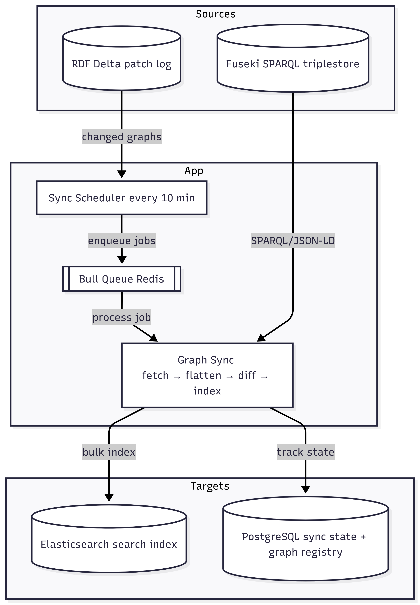

# EDEN Fuseki-to-Elastic Exporter

Syncs RDF data from Apache Jena Fuseki to Elasticsearch. Detects changes via RDF Delta, syncs affected graphs incrementally every 10 minutes, and falls back to a full blue-green reindex when patch gaps are detected. Part of the EDEN WP2 project.

Note: the startup of the project includes **_NO_** dummy data you will have to ingest that yourself into fuseki.

## Architecture



**How it works:**

1. The scheduler polls RDF Delta for new patches since the last known version
2. Patches are parsed to extract which graphs (and optionally which subjects) changed
3. Affected graphs are enqueued as jobs in a Bull queue
4. Each job fetches the graph from Fuseki as JSON-LD, flattens it, and indexes the documents into Elasticsearch
5. If a patch gap is detected (e.g. delta server was reset), a full reindex is triggered automatically
6. Full reindex uses blue-green index swapping for zero downtime

## Stack

| Service       | Image                    | Role                                 |
| ------------- | ------------------------ | ------------------------------------ |
| Fuseki        | `dansknaw/eden-fuseki`   | SPARQL triplestore (source of truth) |
| Elasticsearch | `elasticsearch:9.3.0`    | Search index (target)                |
| RDF Delta     | `conjecto/rdf-delta`     | Change detection via patch log       |
| PostgreSQL    | `postgres:17`            | Sync state + graph registry          |
| Redis         | `redis:7`                | Job queue backend (Bull)             |
| App           | `dansknaw/eden-exporter` | This application                     |

## Getting Started

To run the application locally you can do the following:

```bash
# start the entire stack including the app container
make start

# stop everything
make stop
```

The `app` service's `docker-compose.yml` environment block overrides all localhost URLs with Docker network hostnames automatically.

### Local development setup

Prerequisites: Docker, pnpm.

```bash
# first-time setup (copies .env.example to .env, installs deps)
make setup

# start infrastructure (fuseki, elasticsearch, postgres, redis, rdf-delta) + run migrations
make start:dev

# start the app in watch mode
pnpm run start:dev
```

The app runs on `http://localhost:3000`.

## API

| Method | Route                     | Auth         | Description                 |
| ------ | ------------------------- | ------------ | --------------------------- |
| `GET`  | `/api`                    | -            | Health check                |
| `POST` | `/api/:index/_search`     | -            | Elasticsearch search proxy  |
| `GET`  | `/api/:index/_source/:id` | -            | Get document source by ID   |
| `GET`  | `/api/export`             | Bearer token | Trigger manual full reindex |

### Examples

```bash
# search
curl -X POST http://localhost:3000/api/eden/_search \
  -H "Content-Type: application/json" \
  -d '{"query": {"match_all": {}}, "size": 10}'

# get document by id
curl http://localhost:3000/api/eden/_source/https%3A%2F%2Fdata.4tu.nl%2F

# trigger manual full reindex (requires AUTH_API_TOKEN)
curl -H "Authorization: Bearer $AUTH_API_TOKEN" http://localhost:3000/api/export
```

## Configuration

All environment variables are documented in `.env.example`. The main groups:

- **Core**
- **Fuseki / RDF Delta**
- **Elasticsearch**
- **PostgreSQL**
- **Redis**
- **Auth**

## Development

```bash
pnpm run test                    # run all tests
npx jest /path/to/file.spec.ts   # run a single test
pnpm run lint                    # eslint with auto-fix
pnpm run format                  # prettier
npx tsc --noEmit                 # typecheck
make migrate                     # run prisma migrations
```
